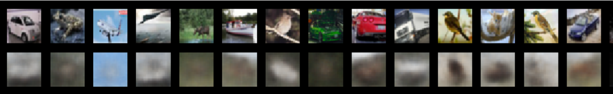
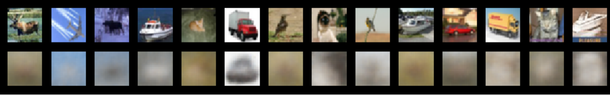
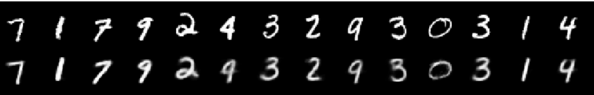
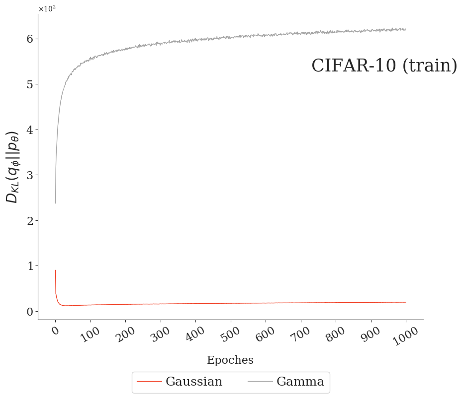
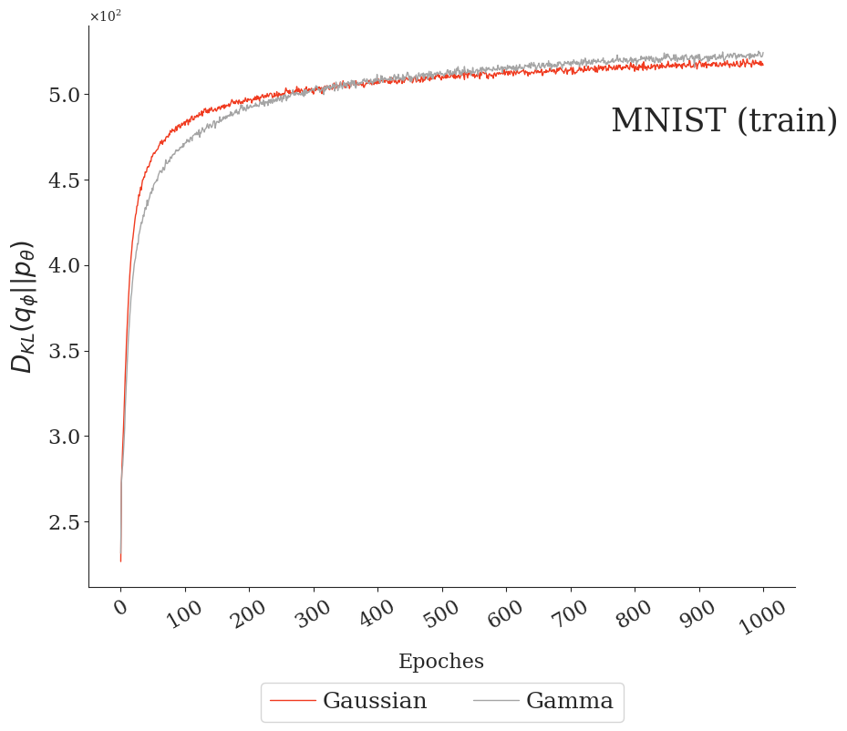
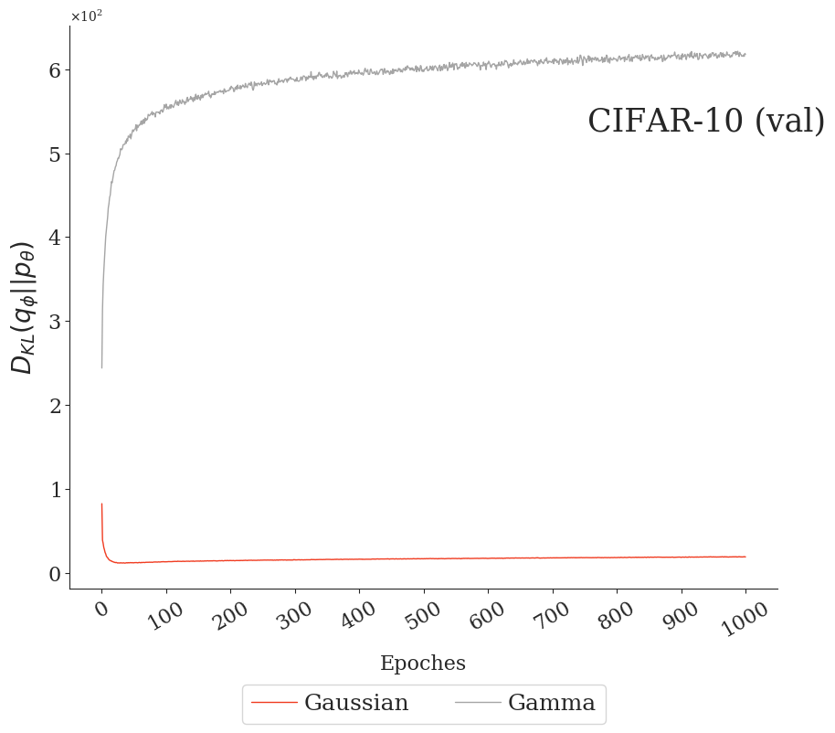
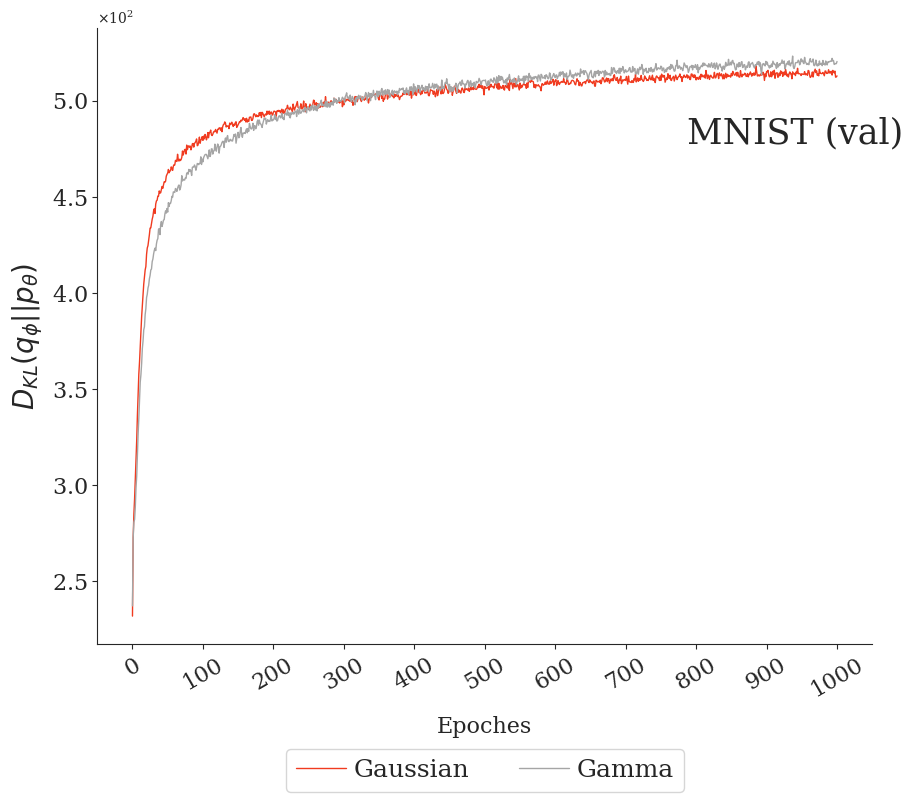
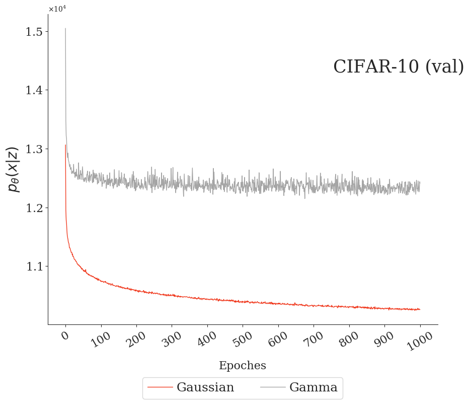
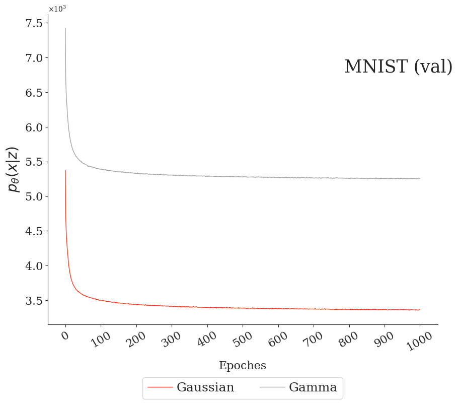

## Vae-Pytorch

This repository has some of my works on VAEs in Pytorch. At the moment I am doing experiments on usual non-hierarchical VAEs. ConvVAE architecture is based on [this](https://github.com/3ammor/Variational-Autoencoder-pytorch) repo, and MLPVAE on [this](https://github.com/pytorch/examples/tree/master/vae).

### Currently implemented VAEs:

1. Standard Gaussian based VAE
2. Gamma reparameterized rejection sampling by [Naesseth et al.](https://arxiv.org/abs/1610.05683). This implementation is based on the work of [Mr. Altosaar](https://github.com/altosaar/gamma-variational-autoencoder).

## How to run
Example 1:
```bash
$ python3 main.py
```

Example 2:
```bash
$ python3 main --model normal --epochs 5000
```

Example 3:
```bash
$ python3 main --model gamma --b_size 256
```

Example 4:
```bash
$ python3 main --model gamma --dataset mnist --z_dim 5
```

### Usage

```
usage: main.py [-h] [--model M] [--epochs N] [--dataset D]
               [--b_size  B] [--z_dim   Z]

optional arguments:
  -h, --help        show this help message and exit
  --model   M       vae model to use: gamma | normal, default is normal
  --epochs N        number of total epochs to run, default is 10000
  --dataset D       dataset to run experiments (cifar-10 or mnist)
  --b_size  B       batch size
  --z_dim   Z       size of the latent space
```

## Experiments
### Qualitative results
* z_dim = 4
* b_size = 128

#### Cifar-10 validation samples (Gaussian VAE)


#### Cifar-10 validation samples (Gamma VAE)


#### Mnist validation samples (Gaussian VAE)


#### Mnist validation samples (Gamma VAE)


#### Binary Mnist validation samples (Gaussian VAE)


#### Binary  Mnist validation samples (Gamma VAE)


### Quantitative results


#### Train

|      | CIFAR-10      | MNIST         | Binary MNIST  | 
|:-----| ------------- |---------------|---------------|
|KL    | |  |  |
|Recons| |  |  |

#### Validation

|            | CIFAR-10      | MNIST         | Binary MNIST  |
|:-----------| ------------- |---------------|---------------|
|KL          | |  |  |
|Recons      | |  |  |
|M Likelihood| |  | 

## Acknowledgments

* To Mr. Altosaar (@altosaar) for helping me on some questions I had in his implementation and several other questions in the subject of VAEs.